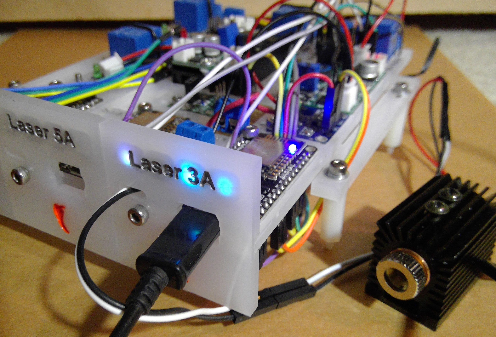
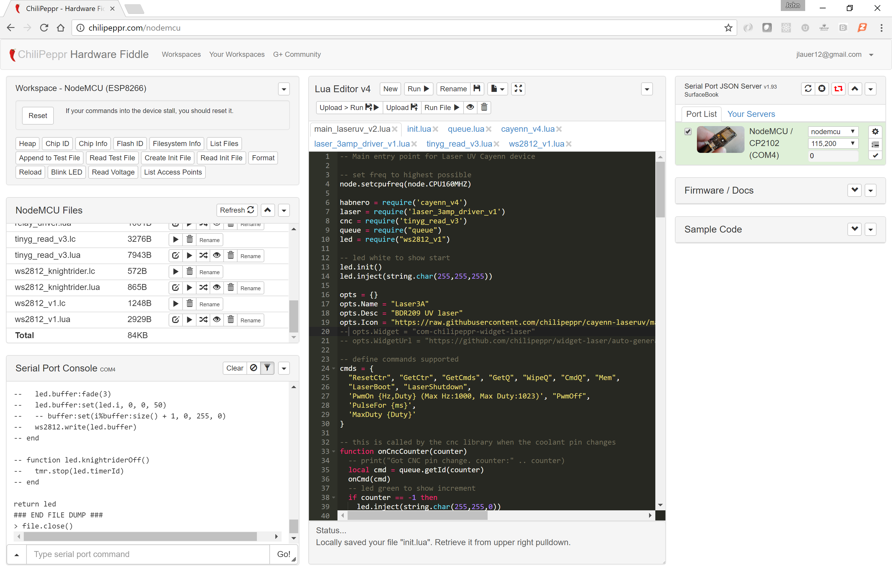
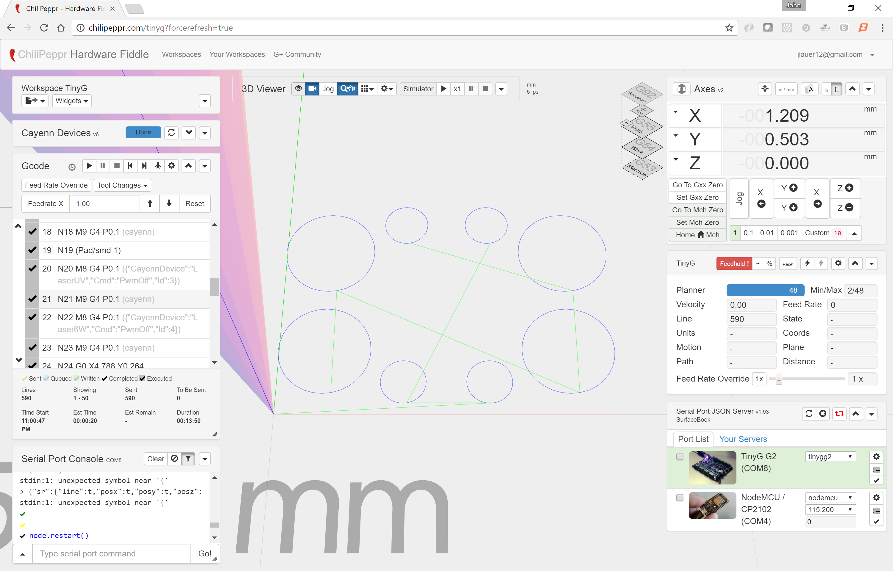

# cayenn-laseruv
ChiliPeppr Cayenn driver for ESP8266 (NodeMCU) implemented in Lua

This code is for a 3A laser driver that works with ChiliPeppr's Cayenn protocol. It runs on a NodeMCU. It talks back and forth to ChiliPeppr to let commands get uploaded to it, it then watches the Coolant pin on the CNC controller and increments a counter every time it sees it go high, and then executes the relevant command based on the ID of the counter.

The reason to do this via the Coolant pin counter is to enable synchronous execution of commands as the main CNC controller plays back the Gcode. For a laser, this makes a lot of sense to correspond with where the CNC machine has moved, and then to turn the laser on at different power levels based on the pre-uploaded list of commands.

This code assumes you have installed the Lua firmware on your ESP8266 including the i2c, pwm, and ws2812 libraries. The firmware used for this build is located at: https://github.com/chilipeppr/workspace-nodemcu/releases/download/v0.13/nodemcu_integer_chilipeppr_cjson_i2c_pwm_ws2812.bin

The laser.lua file also includes code to toggle a main power relay.

Here is how this code is uploaded to the NodeMCU. You use http://chilipeppr.com/nodemcu workspace to edit the code and upload each individual file. The workspace also refers to firmware that is known to work with this Lua code.

You must use <a href="https://github.com/chilipeppr/serial-port-json-server">Serial Port JSON Server 1.93</a> for ChiliPeppr to be able to correctly communicate with your Cayenn devices. There are new features added to SPJS that let
it communicate using UDP and TCP over your network to talk to your devices. In particular the "cayenn-sendudp" and "cayenn-sendtcp" commands are essential. SPJS also
can receive incoming TCP/UDP packets from your devices that then get forwarded to ChiliPeppr.

Here is some example Gcode that you would drag/drop into ChiliPeppr to operate this LaserUV device. The Gcode is for lasering out some circles on a PCB.

(Gcode generated by ChiliPeppr)
(Eagle BRD Solder Mask Widget)
(1/10/2017, 5:21:11 PM)
(Cutting outline of pads/smds)
(Cutting outside pad/smd)
(Mode: laser)
(Laser turn on method: cayenn)
(Cayenn on cmd: {"Cmd":"PwmOn","Hz":1000,"Duty":1023})
(Cayenn off cmd: {"Cmd":"PwmOff"})
(Width of cut: 0.2)
G21 (mm)
M9 (make sure coolant is off)
({"CayennDevice":"LaserUV","Cmd":"LaserBoot","PauseAfter":2})
(Pad/smd 1)
({"Cmd":"PwmOff"})
G0 X4.788 Y0.264
({"Cmd":"PwmOn","Hz":1000,"Duty":1023})
F300 (Feedrate for cut)
G1 X4.807 Y0.268
G1 X4.883 Y0.291
G1 X4.902 Y0.298
G1 X4.972 Y0.336
G1 X4.988 Y0.347
G1 X5.050 Y0.397
G1 X5.064 Y0.411
G1 X5.114 Y0.473
G1 X5.125 Y0.489
G1 X5.163 Y0.559
G1 X5.170 Y0.578
G1 X5.193 Y0.654
G1 X5.197 Y0.673
G1 X5.205 Y0.752
G1 X5.205 Y0.772
G1 X5.197 Y0.851
G1 X5.193 Y0.870
G1 X5.170 Y0.947
G1 X5.163 Y0.965
G1 X5.125 Y1.035
G1 X5.114 Y1.051
G1 X5.064 Y1.113
G1 X5.050 Y1.127
G1 X4.988 Y1.177
G1 X4.972 Y1.188
G1 X4.902 Y1.226
G1 X4.883 Y1.233
G1 X4.807 Y1.256
G1 X4.788 Y1.260
G1 X4.709 Y1.268
G1 X4.689 Y1.268
G1 X4.610 Y1.260
G1 X4.591 Y1.256
G1 X4.514 Y1.233
G1 X4.496 Y1.226
G1 X4.426 Y1.188
G1 X4.410 Y1.177
G1 X4.348 Y1.127
G1 X4.334 Y1.113
G1 X4.284 Y1.051
G1 X4.273 Y1.035
G1 X4.235 Y0.965
G1 X4.228 Y0.947
G1 X4.205 Y0.870
G1 X4.201 Y0.851
G1 X4.193 Y0.772
G1 X4.193 Y0.752
G1 X4.201 Y0.673
G1 X4.205 Y0.654
G1 X4.228 Y0.578
G1 X4.235 Y0.559
G1 X4.273 Y0.489
G1 X4.284 Y0.473
G1 X4.334 Y0.411
G1 X4.348 Y0.397
G1 X4.410 Y0.347
G1 X4.426 Y0.336
G1 X4.496 Y0.298
G1 X4.514 Y0.291
G1 X4.591 Y0.268
G1 X4.610 Y0.264
G1 X4.689 Y0.256
G1 X4.709 Y0.256
G1 X4.788 Y0.264
(Pad/smd 2)
({"Cmd":"PwmOff"})
G0 X2.883 Y0.264
({"Cmd":"PwmOn","Hz":1000,"Duty":1023})
G1 X2.902 Y0.268
G1 X2.978 Y0.291
G1 X2.997 Y0.298
G1 X3.067 Y0.336
G1 X3.083 Y0.347
G1 X3.145 Y0.397
G1 X3.159 Y0.411
G1 X3.209 Y0.473
G1 X3.220 Y0.489
G1 X3.258 Y0.559
G1 X3.265 Y0.578
G1 X3.288 Y0.654
G1 X3.292 Y0.673
G1 X3.300 Y0.752
G1 X3.300 Y0.772
G1 X3.292 Y0.851
G1 X3.288 Y0.870
G1 X3.265 Y0.947
G1 X3.258 Y0.965
G1 X3.220 Y1.035
G1 X3.209 Y1.051
G1 X3.159 Y1.113
G1 X3.145 Y1.127
G1 X3.083 Y1.177
G1 X3.067 Y1.188
G1 X2.997 Y1.226
G1 X2.978 Y1.233
G1 X2.902 Y1.256
G1 X2.883 Y1.260
G1 X2.804 Y1.268
G1 X2.784 Y1.268
G1 X2.705 Y1.260
G1 X2.686 Y1.256
G1 X2.610 Y1.233
G1 X2.591 Y1.226
G1 X2.521 Y1.188
G1 X2.505 Y1.177
G1 X2.443 Y1.127
G1 X2.429 Y1.113
G1 X2.379 Y1.051
G1 X2.368 Y1.035
G1 X2.330 Y0.965
G1 X2.323 Y0.947
G1 X2.300 Y0.870
G1 X2.296 Y0.851
G1 X2.288 Y0.772
G1 X2.288 Y0.752
G1 X2.296 Y0.673
G1 X2.300 Y0.654
G1 X2.323 Y0.578
G1 X2.330 Y0.559
G1 X2.368 Y0.489
G1 X2.379 Y0.473
G1 X2.429 Y0.411
G1 X2.443 Y0.397
G1 X2.505 Y0.347
G1 X2.521 Y0.336
G1 X2.591 Y0.298
G1 X2.610 Y0.291
G1 X2.686 Y0.268
G1 X2.705 Y0.264
G1 X2.784 Y0.256
G1 X2.804 Y0.256
G1 X2.883 Y0.264
(Pad/smd 3)
({"Cmd":"PwmOff"})
G0 X4.788 Y4.328
({"Cmd":"PwmOn","Hz":1000,"Duty":1023})
G1 X4.807 Y4.332
G1 X4.883 Y4.355
G1 X4.902 Y4.362
G1 X4.972 Y4.400
G1 X4.988 Y4.411
G1 X5.050 Y4.461
G1 X5.064 Y4.475
G1 X5.114 Y4.537
G1 X5.125 Y4.553
G1 X5.163 Y4.623
G1 X5.170 Y4.641
G1 X5.193 Y4.718
G1 X5.197 Y4.737
G1 X5.205 Y4.816
G1 X5.205 Y4.836
G1 X5.197 Y4.915
G1 X5.193 Y4.934
G1 X5.170 Y5.011
G1 X5.163 Y5.029
G1 X5.125 Y5.099
G1 X5.114 Y5.115
G1 X5.064 Y5.177
G1 X5.050 Y5.191
G1 X4.988 Y5.241
G1 X4.972 Y5.252
G1 X4.902 Y5.290
G1 X4.883 Y5.297
G1 X4.807 Y5.320
G1 X4.788 Y5.324
G1 X4.709 Y5.332
G1 X4.689 Y5.332
G1 X4.610 Y5.324
G1 X4.591 Y5.320
G1 X4.514 Y5.297
G1 X4.496 Y5.290
G1 X4.426 Y5.252
G1 X4.410 Y5.241
G1 X4.348 Y5.191
G1 X4.334 Y5.177
G1 X4.284 Y5.115
G1 X4.273 Y5.099
G1 X4.235 Y5.029
G1 X4.228 Y5.011
G1 X4.205 Y4.934
G1 X4.201 Y4.915
G1 X4.193 Y4.836
G1 X4.193 Y4.816
G1 X4.201 Y4.737
G1 X4.205 Y4.718
G1 X4.228 Y4.641
G1 X4.235 Y4.623
G1 X4.273 Y4.553
G1 X4.284 Y4.537
G1 X4.334 Y4.475
G1 X4.348 Y4.461
G1 X4.410 Y4.411
G1 X4.426 Y4.400
G1 X4.496 Y4.362
G1 X4.514 Y4.355
G1 X4.591 Y4.332
G1 X4.610 Y4.328
G1 X4.689 Y4.320
G1 X4.709 Y4.320
G1 X4.788 Y4.328
(Pad/smd 4)
({"Cmd":"PwmOff"})
G0 X2.883 Y4.328
({"Cmd":"PwmOn","Hz":1000,"Duty":1023})
G1 X2.902 Y4.332
G1 X2.978 Y4.355
G1 X2.997 Y4.362
G1 X3.067 Y4.400
G1 X3.083 Y4.411
G1 X3.145 Y4.461
G1 X3.159 Y4.475
G1 X3.209 Y4.537
G1 X3.220 Y4.553
G1 X3.258 Y4.623
G1 X3.265 Y4.641
G1 X3.288 Y4.718
G1 X3.292 Y4.737
G1 X3.300 Y4.816
G1 X3.300 Y4.836
G1 X3.292 Y4.915
G1 X3.288 Y4.934
G1 X3.265 Y5.011
G1 X3.258 Y5.029
G1 X3.220 Y5.099
G1 X3.209 Y5.115
G1 X3.159 Y5.177
G1 X3.145 Y5.191
G1 X3.083 Y5.241
G1 X3.067 Y5.252
G1 X2.997 Y5.290
G1 X2.978 Y5.297
G1 X2.902 Y5.320
G1 X2.883 Y5.324
G1 X2.804 Y5.332
G1 X2.784 Y5.332
G1 X2.705 Y5.324
G1 X2.686 Y5.320
G1 X2.610 Y5.297
G1 X2.591 Y5.290
G1 X2.521 Y5.252
G1 X2.505 Y5.241
G1 X2.443 Y5.191
G1 X2.429 Y5.177
G1 X2.379 Y5.115
G1 X2.368 Y5.099
G1 X2.330 Y5.029
G1 X2.323 Y5.011
G1 X2.300 Y4.934
G1 X2.296 Y4.915
G1 X2.288 Y4.836
G1 X2.288 Y4.816
G1 X2.296 Y4.737
G1 X2.300 Y4.718
G1 X2.323 Y4.641
G1 X2.330 Y4.623
G1 X2.368 Y4.553
G1 X2.379 Y4.537
G1 X2.429 Y4.475
G1 X2.443 Y4.461
G1 X2.505 Y4.411
G1 X2.521 Y4.400
G1 X2.591 Y4.362
G1 X2.610 Y4.355
G1 X2.686 Y4.332
G1 X2.705 Y4.328
G1 X2.784 Y4.320
G1 X2.804 Y4.320
G1 X2.883 Y4.328
(Pad/smd 5)
({"Cmd":"PwmOff"})
G0 X6.670 Y3.043
({"Cmd":"PwmOn","Hz":1000,"Duty":1023})
G1 X6.689 Y3.047
G1 X6.866 Y3.100
G1 X6.884 Y3.107
G1 X7.046 Y3.194
G1 X7.063 Y3.205
G1 X7.205 Y3.322
G1 X7.219 Y3.336
G1 X7.336 Y3.478
G1 X7.347 Y3.495
G1 X7.434 Y3.657
G1 X7.441 Y3.675
G1 X7.494 Y3.852
G1 X7.498 Y3.871
G1 X7.516 Y4.054
G1 X7.516 Y4.074
G1 X7.498 Y4.257
G1 X7.494 Y4.276
G1 X7.441 Y4.453
G1 X7.434 Y4.471
G1 X7.347 Y4.633
G1 X7.336 Y4.650
G1 X7.219 Y4.792
G1 X7.205 Y4.806
G1 X7.063 Y4.923
G1 X7.046 Y4.934
G1 X6.884 Y5.021
G1 X6.866 Y5.028
G1 X6.689 Y5.081
G1 X6.670 Y5.085
G1 X6.487 Y5.103
G1 X6.467 Y5.103
G1 X6.284 Y5.085
G1 X6.265 Y5.081
G1 X6.088 Y5.028
G1 X6.070 Y5.021
G1 X5.908 Y4.934
G1 X5.891 Y4.923
G1 X5.749 Y4.806
G1 X5.735 Y4.792
G1 X5.618 Y4.650
G1 X5.607 Y4.633
G1 X5.521 Y4.471
G1 X5.513 Y4.453
G1 X5.460 Y4.276
G1 X5.456 Y4.257
G1 X5.438 Y4.074
G1 X5.438 Y4.054
G1 X5.456 Y3.871
G1 X5.460 Y3.852
G1 X5.513 Y3.675
G1 X5.521 Y3.657
G1 X5.607 Y3.495
G1 X5.618 Y3.478
G1 X5.735 Y3.336
G1 X5.749 Y3.322
G1 X5.891 Y3.205
G1 X5.908 Y3.194
G1 X6.070 Y3.107
G1 X6.088 Y3.100
G1 X6.265 Y3.047
G1 X6.284 Y3.043
G1 X6.467 Y3.025
G1 X6.487 Y3.025
G1 X6.670 Y3.043
(Pad/smd 6)
({"Cmd":"PwmOff"})
G0 X6.670 Y0.503
({"Cmd":"PwmOn","Hz":1000,"Duty":1023})
G1 X6.689 Y0.507
G1 X6.866 Y0.560
G1 X6.884 Y0.568
G1 X7.046 Y0.654
G1 X7.063 Y0.665
G1 X7.205 Y0.782
G1 X7.219 Y0.796
G1 X7.336 Y0.938
G1 X7.347 Y0.955
G1 X7.434 Y1.117
G1 X7.441 Y1.135
G1 X7.494 Y1.312
G1 X7.498 Y1.331
G1 X7.516 Y1.514
G1 X7.516 Y1.534
G1 X7.498 Y1.717
G1 X7.494 Y1.736
G1 X7.441 Y1.913
G1 X7.434 Y1.931
G1 X7.347 Y2.093
G1 X7.336 Y2.110
G1 X7.219 Y2.252
G1 X7.205 Y2.266
G1 X7.063 Y2.383
G1 X7.046 Y2.394
G1 X6.884 Y2.481
G1 X6.866 Y2.488
G1 X6.689 Y2.541
G1 X6.670 Y2.545
G1 X6.487 Y2.563
G1 X6.467 Y2.563
G1 X6.284 Y2.545
G1 X6.265 Y2.541
G1 X6.088 Y2.488
G1 X6.070 Y2.481
G1 X5.908 Y2.394
G1 X5.891 Y2.383
G1 X5.749 Y2.266
G1 X5.735 Y2.252
G1 X5.618 Y2.110
G1 X5.607 Y2.093
G1 X5.521 Y1.931
G1 X5.513 Y1.913
G1 X5.460 Y1.736
G1 X5.456 Y1.717
G1 X5.438 Y1.534
G1 X5.438 Y1.514
G1 X5.456 Y1.331
G1 X5.460 Y1.312
G1 X5.513 Y1.135
G1 X5.521 Y1.117
G1 X5.607 Y0.955
G1 X5.618 Y0.938
G1 X5.735 Y0.796
G1 X5.749 Y0.782
G1 X5.891 Y0.665
G1 X5.908 Y0.654
G1 X6.070 Y0.568
G1 X6.088 Y0.560
G1 X6.265 Y0.507
G1 X6.284 Y0.503
G1 X6.467 Y0.485
G1 X6.487 Y0.485
G1 X6.670 Y0.503
(Pad/smd 7)
({"Cmd":"PwmOff"})
G0 X1.209 Y3.043
({"Cmd":"PwmOn","Hz":1000,"Duty":1023})
G1 X1.228 Y3.047
G1 X1.405 Y3.100
G1 X1.423 Y3.107
G1 X1.585 Y3.194
G1 X1.602 Y3.205
G1 X1.744 Y3.322
G1 X1.758 Y3.336
G1 X1.875 Y3.478
G1 X1.886 Y3.495
G1 X1.972 Y3.657
G1 X1.980 Y3.675
G1 X2.033 Y3.852
G1 X2.037 Y3.871
G1 X2.055 Y4.054
G1 X2.055 Y4.074
G1 X2.037 Y4.257
G1 X2.033 Y4.276
G1 X1.980 Y4.453
G1 X1.972 Y4.471
G1 X1.886 Y4.633
G1 X1.875 Y4.650
G1 X1.758 Y4.792
G1 X1.744 Y4.806
G1 X1.602 Y4.923
G1 X1.585 Y4.934
G1 X1.423 Y5.021
G1 X1.405 Y5.028
G1 X1.228 Y5.081
G1 X1.209 Y5.085
G1 X1.026 Y5.103
G1 X1.006 Y5.103
G1 X0.823 Y5.085
G1 X0.804 Y5.081
G1 X0.627 Y5.028
G1 X0.609 Y5.021
G1 X0.447 Y4.934
G1 X0.430 Y4.923
G1 X0.288 Y4.806
G1 X0.274 Y4.792
G1 X0.157 Y4.650
G1 X0.146 Y4.633
G1 X0.059 Y4.471
G1 X0.052 Y4.453
G1 X-0.001 Y4.276
G1 X-0.005 Y4.257
G1 X-0.023 Y4.074
G1 X-0.023 Y4.054
G1 X-0.005 Y3.871
G1 X-0.001 Y3.852
G1 X0.052 Y3.675
G1 X0.059 Y3.657
G1 X0.146 Y3.495
G1 X0.157 Y3.478
G1 X0.274 Y3.336
G1 X0.288 Y3.322
G1 X0.430 Y3.205
G1 X0.447 Y3.194
G1 X0.609 Y3.107
G1 X0.627 Y3.100
G1 X0.804 Y3.047
G1 X0.823 Y3.043
G1 X1.006 Y3.025
G1 X1.026 Y3.025
G1 X1.209 Y3.043
(Pad/smd 8)
({"Cmd":"PwmOff"})
G0 X1.209 Y0.503
({"Cmd":"PwmOn","Hz":1000,"Duty":1023})
G1 X1.228 Y0.507
G1 X1.405 Y0.560
G1 X1.423 Y0.568
G1 X1.585 Y0.654
G1 X1.602 Y0.665
G1 X1.744 Y0.782
G1 X1.758 Y0.796
G1 X1.875 Y0.938
G1 X1.886 Y0.955
G1 X1.972 Y1.117
G1 X1.980 Y1.135
G1 X2.033 Y1.312
G1 X2.037 Y1.331
G1 X2.055 Y1.514
G1 X2.055 Y1.534
G1 X2.037 Y1.717
G1 X2.033 Y1.736
G1 X1.980 Y1.913
G1 X1.972 Y1.931
G1 X1.886 Y2.093
G1 X1.875 Y2.110
G1 X1.758 Y2.252
G1 X1.744 Y2.266
G1 X1.602 Y2.383
G1 X1.585 Y2.394
G1 X1.423 Y2.481
G1 X1.405 Y2.488
G1 X1.228 Y2.541
G1 X1.209 Y2.545
G1 X1.026 Y2.563
G1 X1.006 Y2.563
G1 X0.823 Y2.545
G1 X0.804 Y2.541
G1 X0.627 Y2.488
G1 X0.609 Y2.481
G1 X0.447 Y2.394
G1 X0.430 Y2.383
G1 X0.288 Y2.266
G1 X0.274 Y2.252
G1 X0.157 Y2.110
G1 X0.146 Y2.093
G1 X0.059 Y1.931
G1 X0.052 Y1.913
G1 X-0.001 Y1.736
G1 X-0.005 Y1.717
G1 X-0.023 Y1.534
G1 X-0.023 Y1.514
G1 X-0.005 Y1.331
G1 X-0.001 Y1.312
G1 X0.052 Y1.135
G1 X0.059 Y1.117
G1 X0.146 Y0.955
G1 X0.157 Y0.938
G1 X0.274 Y0.796
G1 X0.288 Y0.782
G1 X0.430 Y0.665
G1 X0.447 Y0.654
G1 X0.609 Y0.568
G1 X0.627 Y0.560
G1 X0.804 Y0.507
G1 X0.823 Y0.503
G1 X1.006 Y0.485
G1 X1.026 Y0.485
G1 X1.209 Y0.503
({"Cmd":"PwmOff"})
({"Cmd":"LaserShutdown"})
(Done)
